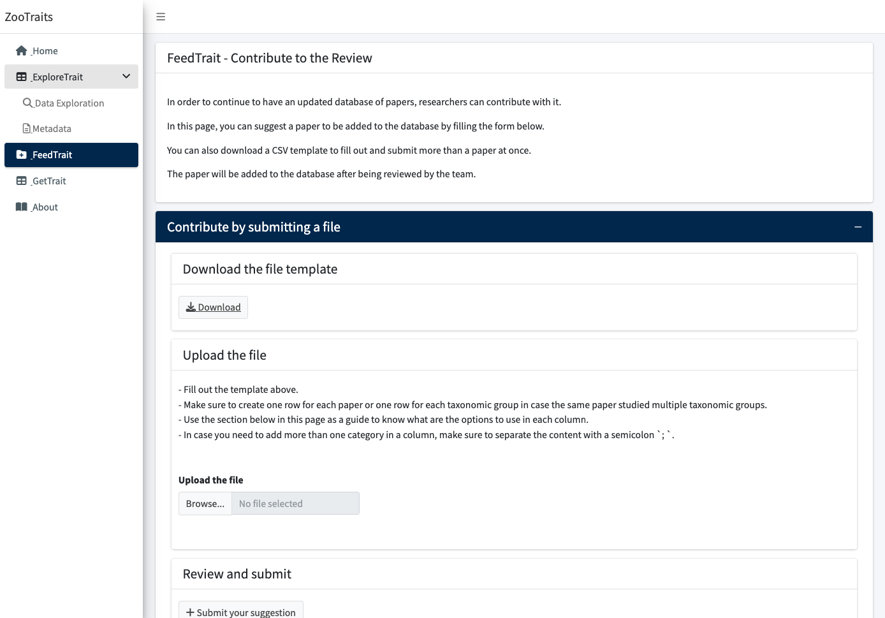

```{r, include = FALSE}
knitr::opts_chunk$set(
  collapse = TRUE,
  comment = "#>"
)
```

The app `zootraits` allows users to contribute to the review, uploading new papers into the database, in the **FeedTrait** panel:

```{r}
#| echo: FALSE
#| out.width: "100%"

```

After uploading a new paper in the **FeedTrait** panel, the data is stored in a [Google Spreadsheet](https://docs.google.com/spreadsheets/d/1nStfAOwUvUuVC4Xo3ArI8i1Be9TxGNdmntfn87OGSy4/edit?usp=sharing). The authors of the app have access to this spreadsheet and can review the data. 

The authors of the app should check regularly the spreadsheet, to check if the data is correct and complete. It is important to check if all the most relevant categories are filled.

If the data is correct, they can change the column `verified` to `TRUE`:

```{r}
#| echo: FALSE
#| out.width: "100%"
knitr::include_graphics("images/google-spreadsheet.png")
```


