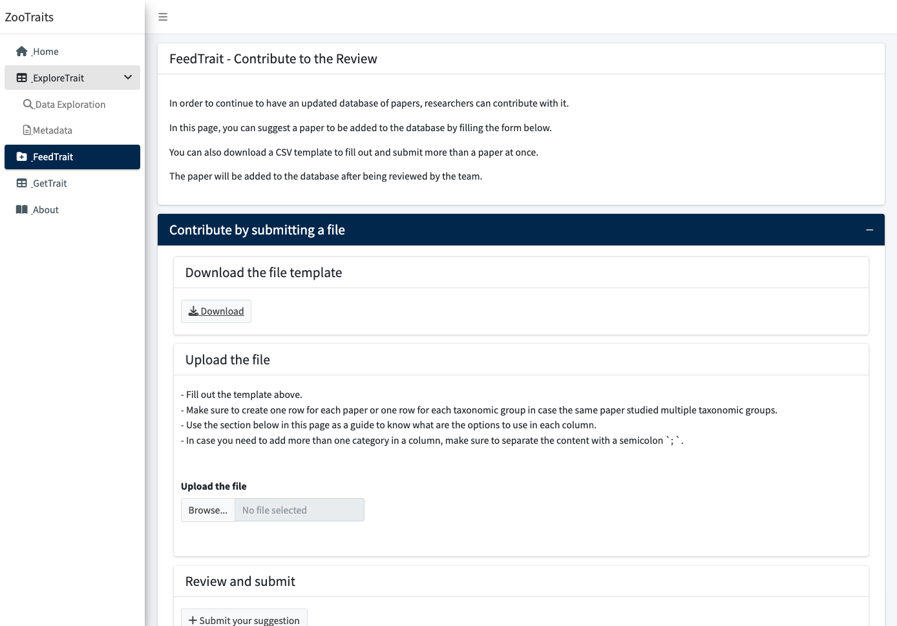
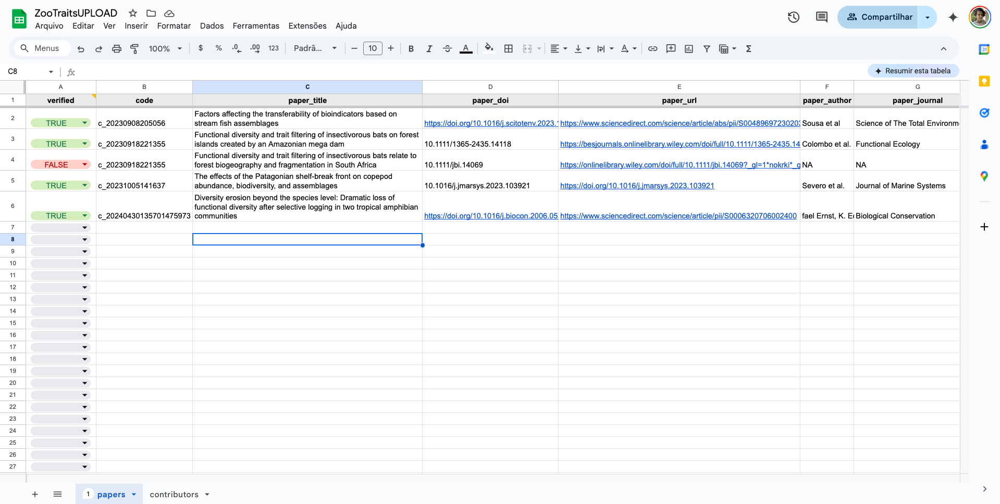
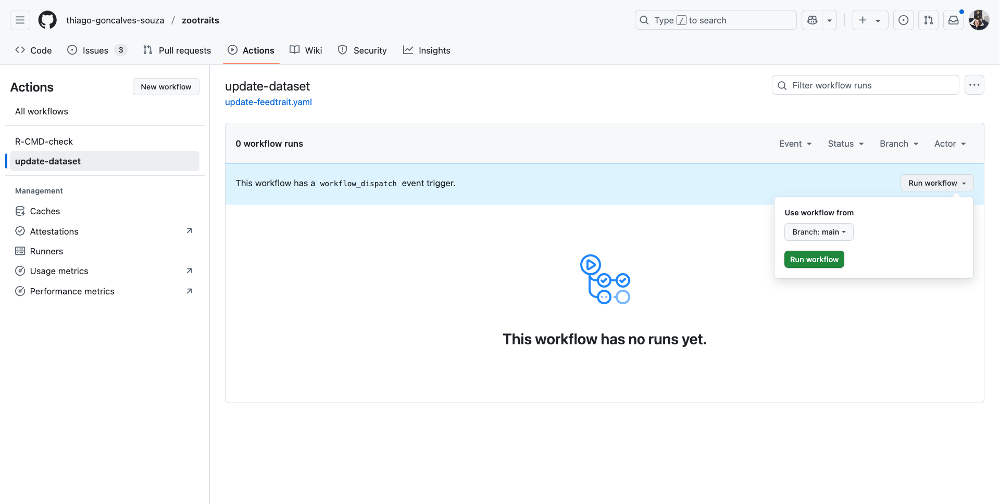
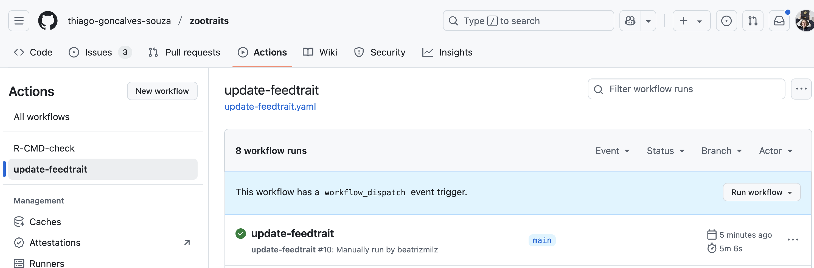
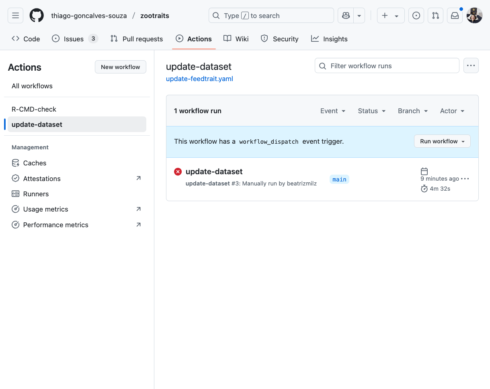

# Upload data from FeedTrait

The app `zootraits` allows users to contribute to the review, uploading new papers into the database, in the **FeedTrait** panel:

In this tutorial, we will explain how to upload new papers into the database, and to upload the app.

## Review the contributions

After someone uploads a new paper in the **FeedTrait** panel, the data is stored in a [Google Spreadsheet](https://docs.google.com/spreadsheets/d/1nStfAOwUvUuVC4Xo3ArI8i1Be9TxGNdmntfn87OGSy4/edit?usp=sharing). The authors of the app have access to this spreadsheet and can review the data. 

The authors of the app should check regularly the spreadsheet, to check if the data is correct and complete. It is important to check if all the most relevant categories are filled.

If the data is correct, they can change the column `verified` to `TRUE`:

## Update the data

To update the data, the authors of the app need to trigger an GitHub Workflow that will update the data used in the app. The workflow is called [`update-feedtrait.yaml`](https://github.com/thiago-goncalves-souza/zootraits/actions/workflows/update-feedtrait.yaml). In the GitHub repository, go to the **Actions** tab, select the workflow `update-feedtrait.yaml` and click on the **Run workflow** button.

Wait for the workflow to finish. You can check the progress of the workflow in the **Actions** tab. If everything goes well, you will see a message like this:

If the workflow fails, you can check the logs to see what went wrong. If you need help, you can contact the developer of the app (Beatriz).

## Update the app

The next step is to deploy again the app. The app is deployed using ShinyApps.io. 

[TO DO: Create a workflow to deploy the app automatically]

After the workflow finishes, the app will be updated automatically. You can check the app in the [zootraits website](https://thiago-goncalves-souza.github.io/zootraits/).
